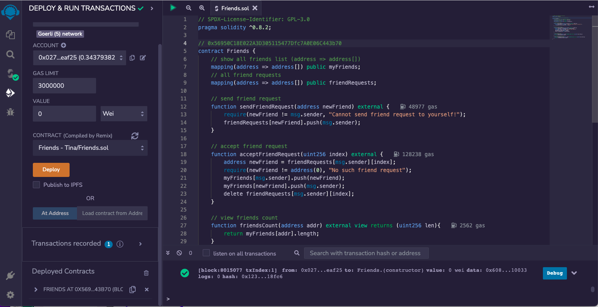

## Week 5
### 作業
#### Friends智能合約：
1. 合約地址：0x56950C18E022A3D305115477Dfc7A0E06C443b70
```
// SPDX-License-Identifier: GPL-3.0
pragma solidity ^0.8.2;

contract Friends {
    // show all friends list (address => address[])
    mapping(address => address[]) public myFriends;
    // all friend requests
    mapping(address => address[]) public friendRequests;

    // send friend request
    function sendFriendRequest(address newFriend) external {
        require(newFriend != msg.sender, "Cannot send friend request to yourself!");
        friendRequests[newFriend].push(msg.sender);
    }

    // accept friend request
    function acceptFriendRequest(uint256 index) external {
        address newFriend = friendRequests[msg.sender][index];
        require(newFriend != address(0), "No such friend request");
        myFriends[msg.sender].push(newFriend);
        myFriends[newFriend].push(msg.sender);
        delete friendRequests[msg.sender][index];
    }

    // view friends count
    function friendsCount(address addr) external view returns (uint256 len){
        return myFriends[addr].length;
    }
    // view friend requests count
    function friendRequestsCount(address addr) external view returns (uint256 len){
        return friendRequests[addr].length;
    }
}
```
2. 提供部署完截圖 